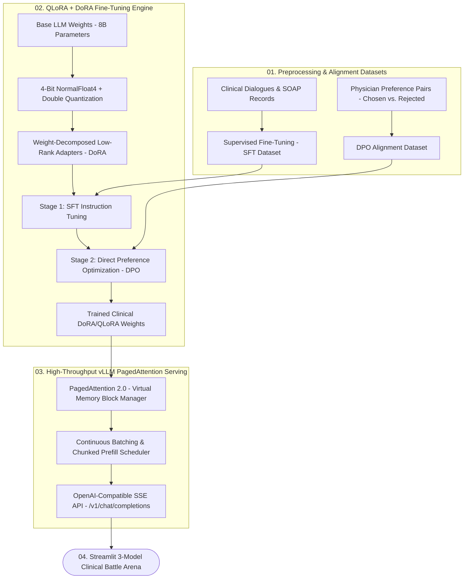

<div align="center">

# 🧠 Domain-Specific Clinical LLM Fine-Tuning & vLLM Serving

[](https://fastapi.tiangolo.com)
[](https://vllm.ai/)
[](https://pytorch.org/)
[](https://streamlit.io/)
[](https://www.docker.com/)

<p align="center">
  <b>Domain-Specific LLM Fine-Tuning and High-Throughput Serving Engine featuring 4-bit QLoRA + DoRA Weight Decomposition, Direct Preference Optimization (DPO), vLLM PagedAttention, and an OpenAI-compatible REST API.</b>
</p>

[✨ Live Model Battle Arena](http://localhost:8501) • [📚 OpenAI API (Swagger)](http://localhost:8000/docs) • [💼 Author Profile](https://github.com/saikrishnayemineni)

</div>

---

## 📌 Architecture & Mathematical Pipeline



---

## 🔬 Mathematical Formulations

### 1. Weight-Decomposed Low-Rank Adaptation (DoRA):
$$W = m rac{W_0 + \Delta W}{\|W_0 + \Delta W\|_c} = m rac{W_0 + rac{lpha}{r} B A}{\|W_0 + rac{lpha}{r} B A\|_c}$$

### 2. Direct Preference Optimization (DPO):
$$\mathcal{L}_{	ext{DPO}}(	heta; \pi_{	ext{ref}}) = -\mathbb{E}_{(x, y_w, y_l) \sim \mathcal{D}} \left[ \log \sigma \left( eta \log rac{\pi_	heta(y_w \mid x)}{\pi_{	ext{ref}}(y_w \mid x)} - eta \log rac{\pi_	heta(y_l \mid x)}{\pi_{	ext{ref}}(y_l \mid x)} 
ight) 
ight]$$

---

## 🚀 Quick Start

### 1. Clone & Setup
```bash
git clone https://github.com/saikrishnayemineni/clinical-llm-finetuning-vllm.git
cd clinical-llm-finetuning-vllm
python -m venv venv
.\venv\Scripts\activate
pip install -r requirements.txt
```

### 2. Run 3-Model Arena Benchmark
```bash
python evaluate_finetuning.py
```

### 3. Launch Interactive Model Arena UI
```bash
streamlit run src/ui/app.py
```
Open: `http://localhost:8501`

### 4. Launch OpenAI-Compatible REST API
```bash
uvicorn src.api.main:app --reload --port 8000
```
Open: `http://localhost:8000/docs` (Use `/v1/chat/completions` like OpenAI SDK)

---

## 👨‍💻 Author

**Sai Krishna Yemineni** — *Production AI/ML Engineer*  
- Portfolio: [sai-krishna-portfolio-drab.vercel.app](https://sai-krishna-portfolio-drab.vercel.app)  
- LinkedIn: [linkedin.com/in/sai-krishna-yemineni](https://www.linkedin.com/in/sai-krishna-yemineni)  
- GitHub: [@saikrishnayemineni](https://github.com/saikrishnayemineni)
